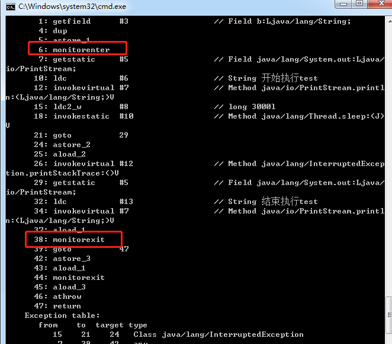

并发编程中肯定会涉及到锁、同步等问题，如果事物都是没有任何关系的，独立运行那就不用管什么并发，但是资源总数有限的，总数涉及到资源的抢占问题，所以就会出现对资源进行管控，防止抢占不均造成流血事件死亡事件（死锁）。

本篇就详细的说一下Java中的锁，相应的机制和原理，来个大彻大悟

Java中锁的方式多种多样，当然其他语言都是会同样的锁处理方式


1.先说说线程安全

单线程肯定不会存在线程安全问题，只有在多线程情况下，对同一资源继续抢占消耗才会出现线程安全问题

，资源可能是 一个属性、一个对象、一个文件、一个数据库表数据。

线程的执行是独立的且不可控的（随机），这就无法预计多线程执行完之后的结果。


2.如何解决这个问题

资源总是有限的，无法避免的，我们希望程序按照我们的意愿来执行，驯服它。

为了避免发生哄抢事件，一次只放一个人进去，进去一个就加把锁，用完就锁打开放另一个进去。

锁于是就发挥了关键性的作用

在Java编程中，锁的实现包括synchronized和Lock

synchronized属于一关键字

Lock属于接口类

------

先来说一说synchronized关键字

不带关键字出现的结果

```java
public class ThreadTest {

    private final List list = new ArrayList<>();

    public void insert(){
        for(int i=0;i<5;i++){
            String s = i+"-"+Thread.currentThread().getName();
            list.add(i);
            System.out.println(s);
        }
    }

    public static void main(String[] args) {

        final ThreadTest tt = new ThreadTest();
        new Thread(new Runnable() {
            @Override
            public void run() {
                tt.insert();
            }
        }).start();

        new Thread(new Runnable() {
            @Override
            public void run() {
                tt.insert();
            }
        }).start();

        new Thread(new Runnable() {
            @Override
            public void run() {
                tt.insert();
            }
        }).start();
    }
}
```

```java
// 每次输出结果都是随机的，毫无规律
Thread-1,idx:0
Thread-2,idx:0
Thread-2,idx:1
Thread-2,idx:2
Thread-2,idx:3
Thread-2,idx:4
Thread-0,idx:0
Thread-0,idx:1
Thread-1,idx:1
Thread-1,idx:2
Thread-1,idx:3
Thread-1,idx:4
Thread-0,idx:2
Thread-0,idx:3
Thread-0,idx:4
```

synchronized的几个知识点

1.对方法增加该关键字，那就只对同一类的同一对象实例加锁，不同对象不受影响。相同类里面的同步方法会发生互斥，执行一个另外一个就出现阻塞。

2.如果方法加了同步关键字，还有static关键字（类锁），那么就是对类进行加锁，不管对象，都会加锁。

3.针对非静态方法加锁，一个线程占用之后，另外都线程就无法再访问该对象的方法，对于非同步方法依然可以访问。类锁和对象锁不会发生互斥，可以同时进行访问

4.父类方法加锁，子类不受影响，如需要定义同步方法需要额外定义。


synchronized使用的几种场景

1.方法级别

​    可以是对象级别，也可以是类级别，唯一的区别是通过static关键字来区分

2.代码块

```java
synchronized (xxx) {
    // xxx 可以是this 标识当前对象，加的锁属于对象锁
    // xxx 可以是一个对象
}
--------------------------------------------------
同步块里面的都为对象锁


intern()方法说明
一个初始为空的字符串池，它由类 String 私有地维护。
当调用 intern 方法时，如果池已经包含一个等于此 String 对象的字符串（用 equals(Object) 方法确定），则返回池中的字符串。否则，将此 String 对象添加到池中，并返回此 String 对象的引用。

--------------------------------------------------
public class ObjSync {
    public static void main(String[] args) {
        final ObjSync os = new ObjSync();
            new Thread(new Runnable() {
                @Override
                public void run() {
                    os.test();
                }
            }).start();
            new Thread(new Runnable() {
                @Override
                public void run() {
                    os.test2();
                }
            }).start();
    }

    public synchronized void test(){
        System.out.println("开始执行test");
        try {
            Thread.sleep(3000);
        } catch (InterruptedException e) {
            e.printStackTrace();
        }
        System.out.println("结束执行test");
    }

    public void test2(){
        System.out.println("开始执行test2");
        synchronized (this){
            System.out.println("结束执行test2");
        }
    }
}

// 输出结果
开始执行test2
开始执行test
结束执行test
结束执行test2
-------------------------------------------
通过输出结果可以看出
test和test2进行互斥，test2先开始，但是锁优先被test先占用，test只有等到test2释放锁之后才能执行，
对象锁和类锁不互斥，只有对象锁和对象锁互斥，可以分析出同步块属于对象锁，锁为相应的对象。
```

```java
-- 代码块里面的锁对象为String
只要对象一样就可以进行锁控制
String settlementKey = REDIS_SETTLEMENT_PREX+"_"+keyCode;
synchronized (String.valueOf(keyCode).intern()) {
// 

}

public class ObjSyncString {

    public  static String s = "a";
    public  String b = "a";
    public  String c = "a";


    public void test(){
        synchronized (b) {
            System.out.println("开始执行test");
            try {
                Thread.sleep(3000);
            } catch (InterruptedException e) {
                e.printStackTrace();
            }
            System.out.println("结束执行test");
        }
    }

    public void test2(){
        synchronized (c) {
            System.out.println("开始执行test2");
            System.out.println("结束执行test2");
        }
    }

    public static void main(String[] args) {
        final ObjSyncString os = new ObjSyncString();
        new Thread(new Runnable() {
            @Override
            public void run() {
                os.test();
            }
        }).start();
        new Thread(new Runnable() {
            @Override
            public void run() {
                os.test2();
            }
        }).start();
    }

}

// 输出结果 
开始执行test
结束执行test
开始执行test2
结束执行test2

----------------------------------------------
只要值一样，就会产生互斥！！！
代码块里面为对象锁，只要对象是一样的就会产生互斥！！！
```

通过  javap-c ObjSyncString  反编译读代码  

这个后续慢慢研究...



synchronized获取锁和释放锁由监视器隐式的进行，不需要使用者关心

------

那好，现在问题来了，貌似synchronized关键字已经可以满足我们的需求了，那要Lock干什么呢？

俗话说得好，得到方便的同时是牺牲了一定的自由，由于程序导致阻塞，锁无法释放，难道程序就不执行了？

鉴如此，还是需要一个能够收放自如，由我们打开和关闭的锁，把钥匙掌握到自己手上貌似更安心一点。

下一小结再深入的说下Lock