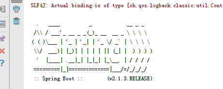

Error:java: 无效的源发行版: 1.8

必须保证maven编译器级别和idea里面的值的project和编译级别一致

[spring boot application.yml文件中文注释乱码](https://blog.csdn.net/u013887008/article/details/82528066)

```java
#SpringBoot底层会把application.yml文件解析为application.properties
#在Spring Boot中多环境配置文件名需要满足application-{profile}.yml的格式，其中{profile}对应你的环境标识

springboot web # 1.x 2.x contextpath配置有区别
```


http://patorjk.com/software/taag/#p=display&f=Graffiti&t=Type%20Something%20

springboot启动变更




springboot不赞同使用jsp，访问jsp页面会提示如下信息


```xml
<dependency>
  <groupId>org.apache.tomcat.embed</groupId>
  <artifactId>tomcat-embed-jasper</artifactId>
</dependency>
<dependency>
  <groupId>javax.servlet</groupId>
  <artifactId>jstl</artifactId>
</dependency>
```

可以在pom中通过增加上述依赖来支持jsp的解析


mybatis中**#{}**和**${}**的区别

前者会进行预编译，解析为?，后者不会进行预编译，直接对应值；#{}写法更安全，防注入，能用#的就不要用$


在mybatis的xml文件做，用select时会有两种结果返回 一是resultMap，一是resultType

resultMap对应就是一个自动的VO，将VO里面的属性和查询的数据列进行映射

```xml
<?xml version="1.0" encoding="UTF-8"?>
<!DOCTYPE mapper PUBLIC "-//mybatis.org//DTD Mapper 3.0//EN" "http://mybatis.org/dtd/mybatis-3-mapper.dtd">
<mapper namespace="com.lp.mapper.UserMapper">

    <resultMap id="BaseResultMap" type="com.lp.vo.UserVo">
        <result column="id" jdbcType="INTEGER" property="id" />
        <result column="userName" jdbcType="VARCHAR" property="userName" />
        <result column="passWord" jdbcType="VARCHAR" property="passWord" />
        <result column="realName" jdbcType="VARCHAR" property="realName" />
    </resultMap>

    <!--resultMap是有用户自定义的类型，属于vo，列与属性的映射见上面-->
    <select id="getMapList" resultMap="BaseResultMap" >
        select * from  user
        <if test="id!=0">
         where id = #{id}
        </if>
    </select>

    <!--resultType为项目里面的实体bean类型，实体直接与数据列对应  -->
    <select id="get" resultType="com.lp.bean.User">
        select * from user where id = #{id}
    </select>

</mapper>
```


PageHelper实现分页原理

1.MybatisPageConf,

```java
/**
 * Created by CPR161 on 2019-05-31.
 * 注册MyBatis分页插件PageHelper
 */
@Configuration
public class MybatisPageConf {
    @Bean
    public PageHelper pageHelper() {
        System.out.println("MyBatisConfiguration.pageHelper()");
        PageHelper pageHelper = new PageHelper();
        Properties p = new Properties();
        p.setProperty("offsetAsPageNum", "true");
        p.setProperty("rowBoundsWithCount", "true");
        p.setProperty("reasonable", "true");
        pageHelper.setProperties(p);
        return pageHelper;
    }
}
```

```java
@RequestMapping("/queryList/{pageNum}")
@ResponseBody
public PageInfo getPageInfo(@PathVariable Integer pageNum){
    if(pageNum==null)
        pageNum = 1;
    // 设置分页参数
    // 第一个参数是第几页；第二个参数是每页显示条数。PageHelper实现分页的原理见项目内文档problem_remark.md
    PageHelper.startPage(pageNum,10);
    List<UserVo> list=userService.getAll();
    PageInfo<UserVo> pageInfo=new PageInfo<UserVo>(list);
    return pageInfo;
}
```

pageHelper会使用ThreadLocal获取到同一线程中的变量信息，各个线程之间的Threadlocal不会相互干扰，也就是Thread1中的ThreadLocal1之后获取到Tread1中的变量的信息，不会获取到Thread2中的信息
所以在多线程环境下，各个Threadlocal之间相互隔离，可以实现，不同thread使用不同的数据源或不同的Thread中执行不同的SQL语句。所以，PageHelper利用这一点通过拦截器获取到同一线程中的预编译好的SQL语句之后将SQL语句包装成具有分页功能的SQL语句，并将其再次赋值给下一步操作，所以实际执行的SQL语句就是有了分页功能的SQL语句

com.github.pagehelper.SqlUtil 中定义

```java
private static final ThreadLocal<Page> LOCAL_PAGE = new ThreadLocal();
```


一个项目中如果包含有子模块，父级中的pom.xml文件进行mvn编译打包，会直接对子模块的pom.xml进行执行，所以父级中不应该有代码，只应该包括一些配置文件


